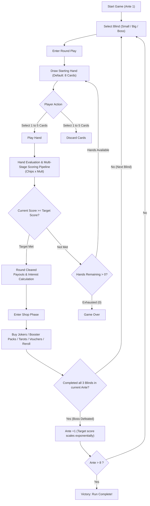

# Balatro Web Full Re-implementation: Game Design Document & PRD

> **Document Classification**: Production Game Design Document (GDD) & Autonomous Agent Benchmark Specification  
> **Target Autonomous Agent**: OpenCode / Hermès x Qwen3.8-Flash-Next Coder IQ1_M (256K Ultra)  
> **Visual Reference Suite**: 4x High-Fidelity 16:9 Retro Pixel UI Mockups located in [`ui_mockups/`](ui_mockups/)

---

## 1. Core Gameplay Loop



---

## 2. Scoring Mathematical Engine Specification

Balatro's mathematical soul lies in its **"Multi-Stage Chained Additive & Multiplicative Explosion (Mult Explosion)"**. The calculation must strictly follow this temporal pipeline:

### 2.1 Final Round Score Formula
$$\text{Score} = \text{Total Chips} \times \text{Total Mult}$$

### 2.2 The 4-Stage Execution Pipeline

1. **Stage 1: Base Hand Values**
   - Identify the highest matching poker hand formed by the 1 to 5 played cards.
   - Fetch the current level's `Base Chips` and `Base Mult` for that hand type.
2. **Stage 2: Card-by-Card Scoring (Left to Right)**
   - Iterate through every scored card participating in the evaluated hand:
     - Card base value: 2–10 give face value, J/Q/K give 10 Chips, Ace gives 11 Chips.
     - Card enhancements: e.g., Bonus Card (+30 Chips), Mult Card (+4 Mult), Glass Card (x2 Mult).
3. **Stage 3: Joker Additive Phase (Left to Right)**
   - Iterate through Joker slots from left to right:
     - Trigger flat additive bonuses: e.g., +50 Chips, +10 Mult.
4. **Stage 4: Joker Multiplicative Phase (Left to Right)**
   - Trigger multiplicative Jokers: e.g., $\times 1.5\text{ Mult}, \times 2\text{ Mult}, \times 3\text{ Mult}$.
   - **Strict Order Dependency**: Jokers evaluate strictly left-to-right! Placing an xMult Joker before a +Mult Joker results in premature multiplication before additions, drastically reducing score output.

---

## 3. Poker Hand Rankings & Initial Level 1 Baseline Values

| Hand Code | Name | Ranking Criteria | Base Chips | Base Mult | Planet Upgrade Scaling |
| :--- | :--- | :--- | :---: | :---: | :--- |
| `HIGH_CARD` | High Card | Highest single card; no matching combinations | 5 | 1 | +10 Chips, +1 Mult (Pluto) |
| `PAIR` | Pair | 2 cards sharing the same numerical rank | 10 | 2 | +15 Chips, +1 Mult (Mercury) |
| `TWO_PAIR` | Two Pair | 2 separate pairs of matching ranks | 20 | 2 | +20 Chips, +1 Mult (Uranus) |
| `THREE_OF_A_KIND` | Three of a Kind | 3 cards sharing the same numerical rank | 30 | 3 | +20 Chips, +2 Mult (Venus) |
| `STRAIGHT` | Straight | 5 cards in consecutive numerical rank (Ace wraps low/high) | 30 | 4 | +30 Chips, +3 Mult (Saturn) |
| `FLUSH` | Flush | 5 cards sharing the exact same suit | 35 | 4 | +15 Chips, +2 Mult (Jupiter) |
| `FULL_HOUSE` | Full House | Three of a Kind + Pair | 40 | 4 | +25 Chips, +2 Mult (Earth) |
| `FOUR_OF_A_KIND` | Four of a Kind | 4 cards sharing the same numerical rank | 60 | 7 | +30 Chips, +3 Mult (Mars) |
| `STRAIGHT_FLUSH` | Straight Flush | 5 cards sharing the same suit in sequential rank | 100 | 8 | +40 Chips, +4 Mult (Neptune) |
| `FLUSH_FIVE` | Flush Five | 5 cards sharing identical rank and identical suit | 160 | 16 | +50 Chips, +3 Mult (Planet X) |

---

## 4. Joker Blueprint Library (16 Core Jokers)

The default Joker slot capacity is **5 slots**. Every Joker has an explicit lifecycle trigger hook:

```javascript
export const JokerTriggerHook = {
  ON_CARD_SCORED: "onCardScored",   // Fired per individual scoring card
  ON_HAND_PLAYED: "onHandPlayed",   // Fired after hand evaluation during additive phase
  ON_INDEPENDENT: "onIndependent",   // Fired during multiplicative explosion phase
  ON_DISCARD:     "onDiscard",       // Fired when player discards cards
  ON_ROUND_END:   "onRoundEnd"       // Fired at completion of round
};
```

### 16 Core Jokers Specifications

1. **Joker**: `+4 Mult` (Unconditional additive bonus).
2. **Greedy Joker**: Played cards with Diamond suit give `+4 Mult` when scored.
3. **Lusty Joker**: Played cards with Heart suit give `+4 Mult` when scored.
4. **Wrathful Joker**: Played cards with Spade suit give `+4 Mult` when scored.
5. **Gluttonous Joker**: Played cards with Club suit give `+4 Mult` when scored.
6. **Jolly Joker**: Gives `+8 Mult` if played hand contains a Pair.
7. **Mad Joker**: Gives `+20 Mult` if played hand contains a Two Pair.
8. **Sly Joker**: Gives `+50 Chips` if played hand contains a Pair.
9. **Half Joker**: Gives `+20 Mult` if played hand contains 3 or fewer cards.
10. **Banner**: Gives `+40 Chips` for each remaining discard.
11. **Mystic Summit**: Gives `+15 Mult` when 0 discards remain.
12. **Cavendish**: `x3 Mult`. 1 in 1000 chance to self-destruct at end of round.
13. **Card Sharp**: Gives `x3 Mult` if the played poker hand type has already been played this round.
14. **Constellation**: Permanently gains `x0.1 Mult` each time any Planet card is used.
15. **Bull**: Gives `+2 Chips` for each $1 the player currently possesses.
16. **Blueprint (Legendary)**: Copies all abilities and hooks of the Joker card placed directly to its right.

---

## 5. Blind Structure & Boss Debuff Constraints

Each run consists of 8 consecutive Antes. Each Ante features 3 Blinds:
- **Small Blind**: Target score multiplier $1.0\times$. Reward: $\$3$. Can be skipped for a Tag reward.
- **Big Blind**: Target score multiplier $1.5\times$. Reward: $\$4$. Can be skipped for a Tag reward.
- **Boss Blind**: Target score multiplier $2.0\times$. Reward: $\$5$. **Cannot be skipped**. Features a debuff.

### 6 Standard Boss Blinds

1. **The Hook**: Automatically and randomly discards 2 cards from player's hand after each played hand.
2. **The Ox**: Playing the player's most played poker hand type resets player cash to $\$0$.
3. **The Pillar**: All cards played earlier in the current Ante become debuffed (0 Chips, no special effects).
4. **The Club / The Goad / The Window / The Head**: Debuffs all Club / Spade / Diamond / Heart cards respectively.
5. **The Arm**: Lowers the played poker hand level by 1 upon being scored (minimum level 1).
6. **The Wall**: Super-massive blind: target score is multiplied by $4\times$ (twice normal Boss score).

---

## 6. Shop System & Economic Model

### 6.1 Economy & Interest Rules
- **Base Round Rewards**: Small Blind ($\$3$), Big Blind ($\$4$), Boss Blind ($\$5$).
- **Remaining Hand Bonus**: Each unused hand at round completion grants **$\$1$**.
- **Bank Interest**: Player earns **$\$1$** interest per $\$5$ saved at round completion, capped at a maximum of **$\$5$** interest (maxed out at $\$25$ bankroll).

### 6.2 Shop Inventory
1. **Joker Shelf**: Default 2 slots containing unowned Jokers available for purchase.
2. **Consumables Shelf**: 1 to 2 slots containing Tarot or Planet cards.
3. **Booster Packs**:
   - *Celestial Pack* (Pick 1 of 3 Planet cards)
   - *Arcana Pack* (Pick 1 of 3 Tarot cards)
   - *Standard Pack* (Pick 1 of 3 enhanced playing cards to add to deck)
4. **Reroll Button**: Base cost $\$5$, increases by $+\$1$ per consecutive reroll during that visit (resets to $\$5$ next round).
5. **Vouchers**: 1 passive voucher per Ante (cost fixed at $\$10$), e.g., `Overstock` (+1 shop card slot), `Hieroglyph` (Ante -1, Hand -1).
