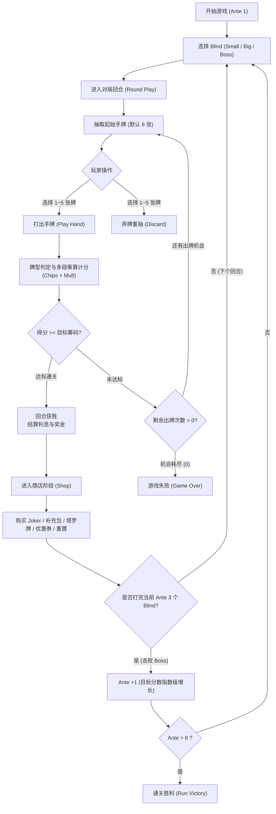

# 《Balatro (小丑牌) Web 完整复刻版》系统设计与产品需求规范书 (GDD & PRD)

> **文档性质**：生产级游戏设计文档 (Game Design Document) & 智能体编码评测基准 (AI Coding Benchmark)  
> **文档编制**：产品总监 (Product Director) & 设计总监 (Design Director)  
> **执行智能体**：Hermès x Qwen3.8-Flash-Next Coder IQ1_M (256K Ultra)  
> **UI 视觉参考**：配套包含 4 张 16:9 高清复古像素 UI 图纸（位于 [`ui_mockups/`](ui_mockups/)）

---

## 1. 核心玩法与循环架构 (Core Gameplay Loop)



---

## 2. 算分数学引擎规范 (Scoring Engine Specification)

Balatro 的核心灵魂是 **“多段链式加法与乘法连锁爆炸（Mult Explosion）”**，计算流程严格遵循以下时序管道：

### 2.1 最终得分公式
$$\text{Round Score} = \text{Total Chips} \times \text{Total Mult}$$

### 2.2 链式计算四部曲 (4-Stage Pipeline)

1. **第一阶段：牌型基础点数 (Base Hand Values)**
   - 识别打出的 1~5 张牌中构成的最高牌型，获取该牌型当前等级的 `Base Chips` 和 `Base Mult`。
2. **第二阶段：打出卡牌逐张结算 (Card-by-Card Scoring)**
   - 按照从左至右的顺序，遍历所有计入牌型的有效卡牌：
     - 卡牌基础点数（2~10 计面值，J/Q/K 计 10 点，A 计 11 点）累加入 `Chips`。
     - 卡牌强化效果（如：Bonus Card +30 Chips, Mult Card +4 Mult, Glass Card ×2 Mult）。
3. **第三阶段：小丑牌常驻与加成结算 (Joker Additive Phase)**
   - 按照小丑牌卡槽从左到右的位置顺序，触发加算效果：
     - 加点小丑（如：+50 Chips, +10 Mult）。
4. **第四阶段：小丑牌最终连乘结算 (Joker Multiplicative Phase)**
   - 触发乘算小丑（如：$\times 1.5\text{ Mult}, \times 2\text{ Mult}, \times 3\text{ Mult}$）。
   - **严格位置依赖**：Joker 从左到右依次触发！如果把乘算 Joker 放在加算 Joker 左边，会导致乘法先生效、加法后生效，极大损失分数。

---

## 3. 德州扑克牌型判定与初始数值表

| 牌型代码 (Code) | 英文名称 | 中文名称 | 判定规则 | 基础 Chips | 基础 Mult | 星球牌升级幅度 |
| :--- | :--- | :--- | :--- | :---: | :---: | :---: |
| `HIGH_CARD` | High Card | 高牌 | 不符合任何组合的单张牌 | 5 | 1 | +10 Chips, +1 Mult (Pluto) |
| `PAIR` | Pair | 对子 | 2 张点数相同的牌 | 10 | 2 | +15 Chips, +1 Mult (Mercury) |
| `TWO_PAIR` | Two Pair | 两对 | 两个不同的对子 | 20 | 2 | +20 Chips, +1 Mult (Uranus) |
| `THREE_OF_A_KIND` | Three of a Kind | 三条 | 3 张点数相同的牌 | 30 | 3 | +20 Chips, +2 Mult (Venus) |
| `STRAIGHT` | Straight | 顺子 | 5 张点数连续的牌 (A 可接 2 或 K) | 30 | 4 | +30 Chips, +3 Mult (Saturn) |
| `FLUSH` | Flush | 同花 | 5 张花色相同的牌 | 35 | 4 | +15 Chips, +2 Mult (Jupiter) |
| `FULL_HOUSE` | Full House | 葫芦 | 1 个三条 + 1 个对子 | 40 | 4 | +25 Chips, +2 Mult (Earth) |
| `FOUR_OF_A_KIND` | Four of a Kind | 四条 | 4 张点数相同的牌 | 60 | 7 | +30 Chips, +3 Mult (Mars) |
| `STRAIGHT_FLUSH` | Straight Flush | 同花顺 | 5 张花色相同且点数连续的牌 | 100 | 8 | +40 Chips, +4 Mult (Neptune) |
| `FLUSH_FIVE` | Flush Five | 同花五条 | 5 张花色相同且点数相同的牌 (需卡牌改造) | 160 | 16 | +50 Chips, +3 Mult (Planet X) |

---

## 4. 小丑牌库规范 (Joker Blueprint Library - 首发 16 张核心牌)

小丑牌槽位上限默认 **5 张**。每张 Joker 拥有严格的触发钩子（Hook）：

```javascript
// Joker 触发钩子定义
export const JokerTriggerHook = {
  ON_CARD_SCORED: "onCardScored",   // 每张有效牌计分时
  ON_HAND_PLAYED: "onHandPlayed",   // 整手牌评定后、加成计算时
  ON_INDEPENDENT: "onIndependent",   // 独立的倍率加成 (乘算/加算)
  ON_DISCARD:     "onDiscard",       // 弃牌时触发
  ON_ROUND_END:   "onRoundEnd"       // 回合结束时触发
};
```

### 16 张精选核心 Joker 清单

1. **Joker (基础小丑)**: `+4 Mult` (无条件加算)。
2. **Greedy Joker (贪婪小丑)**: 每打出一张方片（Diamonds），计分时 `+4 Mult`。
3. **Lusty Joker (好色小丑)**: 每打出一张红桃（Hearts），计分时 `+4 Mult`。
4. **Wrathful Joker (愤怒小丑)**: 每打出一张黑桃（Spades），计分时 `+4 Mult`。
5. **Gluttonous Joker (暴食小丑)**: 每打出一张梅花（Clubs），计分时 `+4 Mult`。
6. **Jolly Joker (快乐小丑)**: 打出包含对子（Pair）的牌型时，`+8 Mult`。
7. **Mad Joker (疯狂小丑)**: 打出包含两对（Two Pair）的牌型时，`+20 Mult`。
8. **Sly Joker (狡猾小丑)**: 打出包含对子（Pair）的牌型时，`+50 Chips`。
9. **Half Joker (半身小丑)**: 若打出的手牌数量 $\le 3$ 张，获得 `+20 Mult`。
10. **Banner (旗帜)**: 每一个剩余未使用的弃牌次数（Discard），提供 `+40 Chips`。
11. **Mystic Summit (神秘峰顶)**: 剩余出牌次数（Hands）等于 0 时，提供 `+15 Mult`。
12. **Cavendish (卡文迪许香蕉)**: `x3 Mult`，每回合结束时有 1/1000 概率自毁。
13. **Card Sharp (老千)**: 若当前回合已经打出过相同的牌型，第二次打出该牌型时获得 `x3 Mult`。
14. **Constellation (星座)**: 本局中每使用一张星球牌，永久增加 `x0.1 Mult`（成长型）。
15. **Bull (公牛)**: 玩家当前每拥有 $1 美元现金，提供 `+2 Chips`（经济联动型）。
16. **Blueprint (蓝图 - 传奇)**: 完美复制右侧相邻的一张 Joker 的全部能力！

---

## 5. 关卡与 Boss Blind 负面限制机制

游戏共 8 个 Ante。每个 Ante 包含 3 场战斗：
- **Small Blind (小盲注)**: 目标分基准 $1.0\times$。通关奖励 $\$3$。可选择跳过（Skip）获取 Tag 奖励。
- **Big Blind (大盲注)**: 目标分基准 $1.5\times$。通关奖励 $\$4$。可选择跳过（Skip）获取 Tag 奖励。
- **Boss Blind (首领盲注)**: 目标分基准 $2.0\times$。通关奖励 $\$5$。**不可跳过**，且附加恶性 Debuff。

### 核心 6 种 Boss Blind 规则实现
1. **The Hook (弯钩)**: 每次出牌后，随机强制丢弃手中 2 张手牌。
2. **The Ox (公牛)**: 若打出玩家当前局打出次数最多的最常用牌型，玩家资金立刻清零归 $\$0$。
3. **The Pillar (石柱)**: 本 Ante 之前回合打过的所有卡牌，在本场战斗中全部失效（Debuffed，点数为0且不触发效果）。
4. **The Club / The Goad / The Window / The Head**: 对应四种花色（梅花/黑桃/方块/红桃）的卡牌全部失效。
5. **The Arm (机械臂)**: 每次出牌后，将打出的牌型等级永久降低 1 级（最低降至 1 级）。
6. **The Wall (城墙)**: 超级巨墙，目标分数翻 $4\times$（普通 Boss 的两倍）！

---

## 6. 商店系统与经济学模型 (Shop & Economy)

### 6.1 经济收益规则
- **通关基础奖励**：Small (\$3), Big (\$4), Boss (\$5)。
- **剩余手牌奖金**：回合结束时，每剩余 1 次出牌机会，额外奖励 **\$1**。
- **银行利息机制 (Interest)**：回合结束时，玩家手头每拥有 $\$5$ 现金，派发 **\$1** 利息（默认最高封顶 $\$5$ 利息，即本金 $\$25$ 时吃满）。

### 6.2 商店货架配置
1. **Joker 展示区**：默认 2 个展位，随机刷新未持有的 Joker。
2. **消耗卡展示区**：展示 1~2 张塔罗牌或星球牌。
3. **补充包区 (Booster Packs)**：
   - *Celestial Pack* (选 1 张星球牌)
   - *Arcana Pack* (选 1 张塔罗牌)
   - *Standard Pack* (选 1 张强化卡牌加入牌组)
4. **重置按钮 (Reroll)**：初始单次重置花费 $\$5$，每次重置后费用累加 $+\$1$（下一回合重置回 $\$5$）。
5. **兑换券 (Vouchers)**：每 Ante 刷新 1 张永久全局增益被动卡（售价固定 $\$10$），如 `Overstock`（商店多一格货架）、`Hieroglyph`（Ante -1，手牌 -1）。
