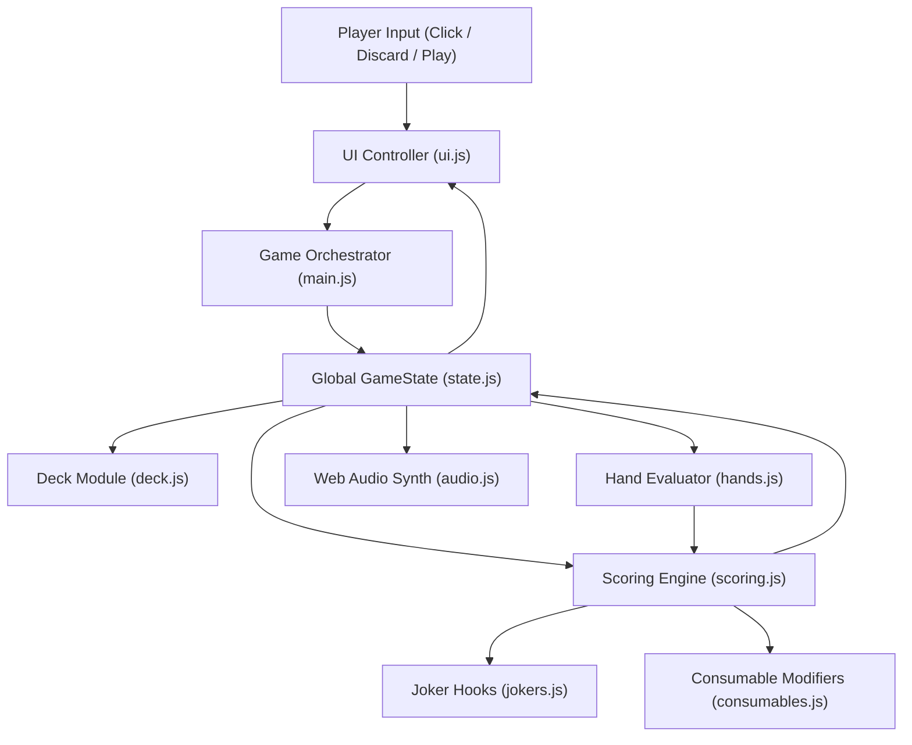

# Balatro Web: Modular Architecture & Engineering Specification

> **Classification**: Production-Grade Modular Frontend Architecture Blueprint  
> **Target Execution Agent**: Autonomous Coding Agent (OpenCode / Hermès)  
> **Core Mandate**: Strict modular separation using modern Native ES Modules (`type="module"`). Monolithic single-file spaghetti code is strictly forbidden.

---

## 1. Why Single Monolithic Files Are Strictly Forbidden

In automated coding benchmarks, AI agents often attempt to dump 2,000 lines of mixed UI, CSS, game rules, and animations into a single `index.html`. This leads to catastrophic failure modes:
1. **Token Truncation & Loop Panics**: Monolithic files exceed clean context windows, corrupting files mid-write and inducing looping behavior.
2. **Impossibility of Surgical Refactoring**: Modifying one Joker logic requires re-generating the entire 2,000-line file, causing syntax regression.
3. **Severe Tight Coupling**: Game state and scoring logic become entangled with DOM manipulation, preventing headless automated unit testing.

Therefore, this architecture strictly enforces **ES6 Native Modules (`type="module"`)** with zero compilation overhead (no Webpack/Vite required). The game runs out-of-the-box in any modern browser by directly opening `index.html`.

---

## 2. Target File Structure & Module Responsibilities

```
D:\Strata\balatro_intelligence_test\balatro_game\
├── index.html                 # Main container: CRT shader filter, canvas, control panel mounts
├── css/
│   ├── main.css              # Global retro CRT scanlines, felt green background, typography
│   ├── cards.css             # Skewed card transforms, elevation, selection state, foil shaders
│   └── ui.css                # Neon glowing scoreboard, shop counters, blind cards, modals
├── js/
│   ├── config.js             # Static data: poker hand chips/mult tables, Ante scaling, Boss list
│   ├── state.js              # Reactive GameState management and PubSub event bus
│   ├── deck.js               # Deck manager: standard 52 cards, Fisher-Yates shuffle, draw/discard piles
│   ├── hands.js              # Poker hand identification algorithm (High Card to Flush Five)
│   ├── scoring.js            # 4-stage pipeline math engine (Base -> Cards -> Jokers Add -> Jokers Mult)
│   ├── jokers.js             # 16 Core Joker blueprints, hook dispatcher, and dynamic evaluation
│   ├── consumables.js        # Consumable system: Tarot cards (enhancements) & Planet cards (upgrades)
│   ├── shop.js               # Shop system: inventory generation, buy/sell, booster packs, rerolls
│   ├── ui.js                 # DOM render controller, card selection lift, chip tally rollups
│   ├── audio.js              # Native Web Audio API synthesizer (card slide, chip ping, mult boom)
│   └── main.js               # Main game orchestrator (round lifecycle, blind flow, win/loss check)
└── tests/
    └── harness.js            # Headless automated test suite (runnable in Node.js or browser console)
```

---

## 3. Module Communication & Data Flow Topology



---

## 4. Key Data Models (TypeScript/JSDoc Schemas)

### 4.1 Card Object
```javascript
export interface Card {
  id: string;               // Unique ID, e.g., "card_c_10_01"
  suit: 'S'|'H'|'D'|'C';    // Spades, Hearts, Diamonds, Clubs
  value: number;            // 2..10, J(11), Q(12), K(13), A(14)
  baseChips: number;        // Default: 2-10 face value, 10/J/Q/K is 10, A is 11
  enhancement: 'none' | 'bonus' | 'mult' | 'wild' | 'glass' | 'steel' | 'stone' | 'gold';
  edition: 'base' | 'foil' | 'holo' | 'polychrome'; // Foil (+50c), Holo (+10m), Poly (x1.5m)
  debuffed: boolean;        // Disabled by active Boss Blind
}
```

### 4.2 Joker Object
```javascript
export interface Joker {
  id: string;               // e.g., "joker_cavendish"
  name: string;             // e.g., "Cavendish"
  rarity: 'common'|'uncommon'|'rare'|'legendary';
  cost: number;             // Shop price, e.g., $4, $6, $8
  description: string;      // Human-readable effect text
  // Lifecycle Hook Functions
  onCardScored?: (card: Card, context: ScoringContext) => { chips?: number, mult?: number };
  onHandPlayed?: (handType: string, cards: Card[], context: ScoringContext) => { chips?: number, mult?: number, xMult?: number };
  onRoundEnd?: (context: RoundContext) => { money?: number, selfDestruct?: boolean };
}
```

### 4.3 Global GameState
```javascript
export interface GameState {
  ante: number;             // Current Ante (1 to 8)
  round: number;            // Round counter
  currentBlind: 'small' | 'big' | 'boss';
  blindTargetScore: number; // Required chips to beat current blind (e.g., 300, 450, 600)
  currentRoundScore: number;// Cumulative score within current round
  handsRemaining: number;   // Number of hands player can play (default: 4)
  discardsRemaining: number;// Number of discards player can use (default: 3)
  money: number;            // Player wallet cash
  jokerSlots: number;       // Maximum Joker capacity (default: 5)
  consumableSlots: number;  // Maximum consumable capacity (default: 2)
  deck: Card[];             // Draw deck pile
  hand: Card[];             // Cards currently in player's hand (default limit: 8)
  discards: Card[];         // Discard pile
  jokers: Joker[];          // Owned Jokers (Array order is calculation-critical)
  consumables: any[];       // Owned Tarot / Planet cards
  vouchers: string[];       // Active passive voucher identifiers
  bossDebuff: string | null;// Identifier of active Boss constraint
}
```

---

## 5. Automated Unit Test & Verification Specification

To rigorously prove mathematical correctness and execution integrity, `tests/harness.js` must implement **4 critical assertion suites**:

1. **Poker Hand Evaluation Assertions**:
   - Any 5 cards sharing identical suit must assert to `FLUSH`.
   - `[10, J, Q, K, A]` must assert to highest `STRAIGHT`.
   - Hand evaluation must correctly handle unordered inputs and select the optimal 5-card subset when 5 cards are played.
2. **Scoring Pipeline Order Verification**:
   - Confirm formula sequence: `(Base + Cards + Joker_Add) * (Base_Mult + Joker_Add_Mult) * (Joker_XMult)`.
   - Verify that placing a `x2 Mult` Joker to the left of a `+10 Mult` Joker produces a strictly lower score than placing it to the right.
3. **Boss Blind Debuff Application**:
   - Verify under `The Pillar` that cards played in previous rounds receive `debuffed === true` and contribute 0 chips.
4. **Economic Interest Calculation**:
   - Verify that $\$24$ bankroll awards exactly $\$4$ interest, while $\$30$ bankroll caps correctly at $\$5$ interest.
