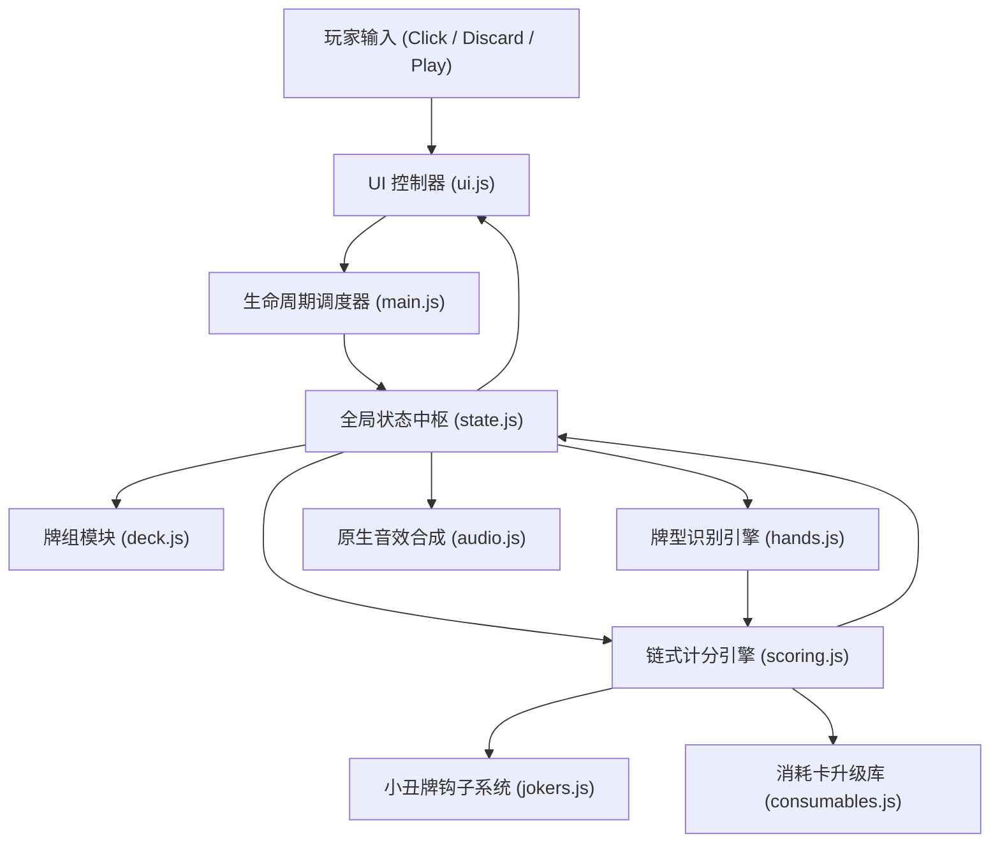

# 《Balatro Web 模块化架构规划与代码工程设计书》

> **架构性质**：企业级模块化前端工程规范 (Modular Architecture Blueprint)  
> **设计角色**：设计总监 (Design Director) & 架构师 (Lead Architect)  
> **目标执行者**：Hermès 编码智能体（用于指引其分模块、分阶段高质量编码，杜绝单文件面条代码）

---

## 1. 为什么坚决杜绝“单文件单体代码 (Single Monolithic File)”

在以往测试中，AI 常常试图把 2000 行包含逻辑、样式、牌组、算分、动画全部揉在单个 `index.html` 中，导致：
1. **Token 爆炸截断**：单个文件过大，超出单次输出视窗导致文件写破损或思考死循环。
2. **无法局部重构**：修改一个小丑牌效果就必须把整页 2000 行重写一遍，极易引发文件损坏。
3. **逻辑耦合严重**：UI 渲染与德扑算分混合在一起，无法进行无界面的自动化单测（Headless Unit Testing）。

因此，本架构强制要求按 **ES6 原生模块化规范（Native ES Modules, `type="module"`）** 进行分层拆解！无需复杂构建打包工具（Webpack/Vite），原生现代浏览器直接打开 `index.html` 即可零构建极速运行！

---

## 2. 推荐代码目录与文件职责规范

```
D:\Strata\balatro_intelligence_test\balatro_game\
├── index.html                 # 主入口容器 (CRT 滤镜层、主画布、操作面板挂载点)
├── css/
│   ├── main.css              # 全局复古 CRT 扫描线、暗绿色桌布、字体与响应式布局
│   ├── cards.css             # 扑克牌、Joker牌、塔罗牌的拟物样式、悬停起伏与选中动效
│   └── ui.css                # 记分板霓虹发光字、商店货架、盲注选择卡、结算弹窗样式
├── js/
│   ├── config.js             # 静态数据：牌型初始筹码/倍率表、Ante目标分阶梯表、Boss清单
│   ├── state.js              # 全局响应式状态机 (GameState) 与事件发布订阅器 (PubSub)
│   ├── deck.js               # 牌组管理：标准52张牌生成、Fisher-Yates洗牌算法、抽牌/弃牌堆
│   ├── hands.js              # 德州扑克牌型自动识别核心算法 (高牌/对子/同花/顺子/葫芦等)
│   ├── scoring.js            # 四阶段链式乘算计分引擎 (Base -> Cards -> Jokers Add -> Jokers Mult)
│   ├── jokers.js             # 16张小丑牌蓝图库、触发钩子调度器与动态增益计算
│   ├── consumables.js        # 消耗品系统：塔罗牌 (卡牌赋能) 与星球牌 (牌型永久升级)
│   ├── shop.js               # 商店系统：随机货架生成、买卖逻辑、补充包开包、Reroll费用递增
│   ├── ui.js                 # DOM 渲染控制器、卡牌点击多选升降动画、数字跳动动画、CRT震动
│   ├── audio.js              # Web Audio API 原生合成音效 (出牌、洗牌、筹码跳字、清脆倍率音)
│   └── main.js               # 游戏主生命周期调度 (回合初始化、盲注流转、胜负仲裁)
└── tests/
    └── harness.js            # 无头自动化逻辑单测脚本 (可由 Node/浏览器直接运行验收逻辑)
```

---

## 3. 核心模块通信与数据流转拓扑



---

## 4. 关键数据模型结构定义 (Data Schemas)

### 4.1 卡牌对象 (Card Object)
```javascript
export interface Card {
  id: string;               // 唯一UUID (如 "card_c_10_01")
  suit: 'S'|'H'|'D'|'C';    // 黑桃(Spades), 红桃(Hearts), 方片(Diamonds), 梅花(Clubs)
  value: number;            // 2..10, J(11), Q(12), K(13), A(14)
  baseChips: number;        // 默认 2~10为面值, 10/J/Q/K为10, A为11
  enhancement: 'none' | 'bonus' | 'mult' | 'wild' | 'glass' | 'steel' | 'stone' | 'gold';
  edition: 'base' | 'foil' | 'holo' | 'polychrome'; // 闪卡(+50c) / 全息(+10m) / 多色(x1.5m)
  debuffed: boolean;        // 是否被 Boss 盲注禁用
}
```

### 4.2 小丑牌对象 (Joker Object)
```javascript
export interface Joker {
  id: string;               // 如 "joker_cavendish"
  name: string;             // 如 "Cavendish"
  rarity: 'common'|'uncommon'|'rare'|'legendary';
  cost: number;             // 售价 (如 $4, $6, $8)
  description: string;      // 描述文本
  // 核心钩子函数定义
  onCardScored?: (card: Card, context: ScoringContext) => { chips?: number, mult?: number };
  onHandPlayed?: (handType: string, cards: Card[], context: ScoringContext) => { chips?: number, mult?: number, xMult?: number };
  onRoundEnd?: (context: RoundContext) => { money?: number, selfDestruct?: boolean };
}
```

### 4.3 全局游戏状态 (GameState Schema)
```javascript
export interface GameState {
  ante: number;             // 当前底注 (1 ~ 8)
  round: number;            // 当前总回合计数
  currentBlind: 'small' | 'big' | 'boss';
  blindTargetScore: number; // 当前盲注达标所需分数 (如 300, 450, 600)
  currentRoundScore: number;// 当前回合累积得分
  handsRemaining: number;   // 剩余出牌机会 (默认 4)
  discardsRemaining: number;// 剩余弃牌机会 (默认 3)
  money: number;            // 当前资金现金
  jokerSlots: number;       // 小丑牌槽上限 (默认 5)
  consumableSlots: number;  // 消耗卡槽上限 (默认 2)
  deck: Card[];             // 抽牌堆
  hand: Card[];             // 当前玩家手中的牌 (默认上限 8)
  discards: Card[];         // 已弃牌堆
  jokers: Joker[];          // 已持有的 Joker 列表 (顺序敏感)
  consumables: any[];       // 已持有的消耗牌
  vouchers: string[];       // 已激活的兑换券清单
  bossDebuff: string | null;// 当前生效的 Boss 特性
}
```

---

## 5. 质量门禁与单测断言规范 (Unit Test & QA Gates)

为证明 Hermès 的编码智力与实现严谨性，工程必须在 `tests/harness.js` 中包含以下 **4 组硬核逻辑断言**：

1. **牌型识别断言 (Hand Evaluation Assertions)**：
   - 包含任意 5 张相同花色的牌必须断言为 `FLUSH`。
   - `[10, J, Q, K, A]` 必须准确断言为最高级别的 `STRAIGHT`。
   - 乱序输入的 5 张牌必须具备自动排序并准确判定。
2. **多段算分顺序断言 (Scoring Pipeline Order)**：
   - 验证：`(Base + Cards + Joker_Add) * (Base_Mult + Joker_Add_Mult) * (Joker_XMult)` 数学时序 100% 吻合。
   - 验证：放置在最左边的 `x2 Mult` 与放置在最右边的 `x2 Mult` 分数差异正确。
3. **Boss 盲注 Debuff 结算断言**：
   - 验证在 `The Pillar` 规则下，上一回合出过的卡牌在此回合 `debuffed === true` 且贡献筹码为 0。
4. **经济利息封顶断言**：
   - 验证现金为 $\$24$ 时利息为 $\$4$，现金为 $\$30$ 时利息正确封顶为 $\$5$。
