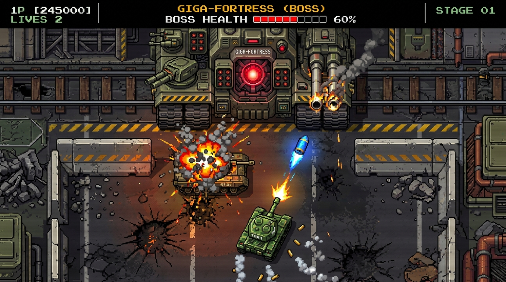

# 🕹️ 街机重装坦克大战（Arcade Voxel Tank Battle: Iron Fortress）全案开发设计规范 (Master GDD / PRD)

> **文档定位**：全功能商业级街机游戏·大模型自适应开发专用主设计书（Master GDD）  
> **目标工程交付**：单文件 HTML5（纯原生 Canvas 2D + Web Audio API，零外部图片/音频/字体依赖，即开即玩）  
> **视觉设计语言**：大颗粒复古像素 × 伪体素 2.5D 层叠立体感（Chunky Retro Pixel × Pseudo-Voxel Aesthetics）

---

## 🖼️ 核心视觉参考图 (Visual Reference Target)



> 📌 **视觉基准锚点**：
> 1. **顶部 1/3~1/2 屏宽**：超巨型陆上要塞 Boss（Giga-Fortress），多炮管喷火、中央发光反应堆；
> 2. **中部**：2~3 倍车身长的小 Boss 巡洋装甲车，伴随剧烈体素方块爆炸粒子；
> 3. **底部**：高机动绿色玩家坦克，独立炮塔朝向，枪口爆火花与弹壳抛洒；
> 4. **材质手感**：大颗粒色块、伪体素高光与侧翼阴影、强烈的重工业街机打击感。

---

## 一、 核心架构与运行规格 (System Architecture)

### 1. 技术栈与运行环境
- **纯原生前端**：单一 `index.html` 文件，包含完整 HTML 结构、CSS 样式、JavaScript 逻辑引擎；
- **渲染引擎**：原生 HTML5 Canvas 2D Context（`image-rendering: pixelated;`）；
- **音频引擎**：原生 `AudioContext` 纯数学波形合成（方波、三角波、白噪声衰减），绝无外链 MP3/WAV；
- **运行帧率**：锁死 `60 FPS`，采用固定物理时间步长（Fixed Timestep Delta Time Accumulator）避免掉帧穿模。

### 2. 逻辑分辨率与自适应视口
- **基准画布尺寸**：`800 × 600`（标准 4:3 复古街机黄金画幅）；
- **网格系统（Grid）**：横向 $25$ 列，纵向 $18$ 行（每个标准地形 Tile 为 $32 \times 32$ 像素，居中留边）；
- **宏像素基准（Macro-Pixel Unit）**：定义 `SCALE = 2` 或 `SCALE = 3`（每个视觉像素实际占据 $2\times2$ 物理画布像素，塑造浑厚的大颗粒街机色块感）；
- **全屏响应式 CSS**：
  ```css
  body {
    margin: 0; background: #0c0d10; color: #fff;
    display: flex; flex-direction: column; align-items: center; justify-content: center;
    min-height: 100vh; overflow: hidden; touch-action: none;
  }
  canvas {
    display: block; width: min(96vw, calc(94vh * 4 / 3)); height: auto;
    image-rendering: pixelated; border: 3px solid #2a2e38; border-radius: 6px;
    box-shadow: 0 0 30px rgba(0,0,0,0.8), 0 0 10px rgba(80,120,200,0.2);
  }
  ```

---

## 二、 伪体素 2.5D 像素渲染圣经 (The Pseudo-Voxel Pipeline)

为了在纯 2D Canvas 上呈现出宛如《Crossy Road》或《合金弹头》般厚重结实的“体素方块积木感”，必须采用**高度挤压层叠渲染管线（Height-Extrusion Layering Pipeline）**：

### 1. 经典街机 16 色体素调色板（Palette Definitions）
```javascript
const PALETTE = {
  // 玩家体系
  P_SHADOW:   "#1b3b24", P_BASE:   "#2f683e", P_LIGHT:  "#529e64", P_TREAD:  "#1c2220",
  // 敌军常规军工体系
  E_SHADOW:   "#28303b", E_BASE:   "#445366", E_LIGHT:  "#70859e",
  // 精英沙漠装甲
  ELITE_SHAD: "#52371b", ELITE_BASE:"#8a5e2f", ELITE_LGT:"#c79152",
  // Boss 熔岩重金属
  BOSS_SHAD:  "#29142b", BOSS_BASE: "#572159", BOSS_LGT: "#9e388b",
  BOSS_CORE:  "#e61937", CORE_WHITE:"#ffffff",
  // 地形环境
  BRICK_DARK: "#572314", BRICK_MID: "#8a3c25", BRICK_LGT:"#c45f3f",
  STEEL_DARK: "#333d47", STEEL_MID: "#576675", STEEL_LGT:"#8fa4b8",
  WATER_DEEP: "#133857", WATER_LGT: "#2b6794",
  GRASS_DARK: "#1e4d28", GRASS_LGT: "#337a42",
  FX_FIRE:    "#ff7b00", FX_SMOKE:  "#666e75"
};
```

### 2. 伪体素分层绘制算法（载具渲染示例）
任何坦克均由 3 个独立高度层组成：
1. **Layer 0（地面投影与履带）**：在真实坐标 $(x, y)$ 处，绘制深黑色半透明阴影与带锯齿轮廓的深色履带底盘；
2. **Layer 1（车身装甲块）**：向上垂直偏移 `$-2 \times SCALE$`，以基底色绘制坚实的矩形机体，四周留 1 像素暗色勾边，形成侧立面；
3. **Layer 2（炮塔与顶盖高光）**：再向上偏移 `$-4 \times SCALE$`，顶面填充浅色高光，绘制圆形或方形舱盖，并在上方绘制独立旋转的方管炮身。

### 3. 体素方块碎裂爆炸系统（Voxel Chip Physics）
- 严禁使用普通半透明圆形爆炸！
- 每次坦克爆炸或砖墙破碎，在对象池中生成 $16 \sim 32$ 块 **$3 \times 3$ 宏像素体素微块（Voxel Chips）**；
- 碎片携带初始立体参数：
  ```javascript
  {
    x, y, z: 4,                  // 空间三维高度
    vx: (Math.random()-0.5)*8,   // 平面扩散速度
    vy: (Math.random()-0.5)*8,
    vz: Math.random()*6 + 2,     // 向上弹跳速度
    color: '#c45f3f',            // 取材自被摧毁物体的材质色
    rot: Math.random()*Math.PI,  // 翻滚角速度
    vRot: (Math.random()-0.5)*0.3,
    life: 1.0                    // 衰减寿命
  }
  ```
- 碎片受到重力 $g = 0.3$ 作用向地面坠落，并在 $z \le 0$ 时产生一次**地表反弹阻尼（vz = -vz * 0.4）**，最后散落在地面渐变消散。

---

## 三、 实体清单与精确绘制规格书 (The Complete Sprite Inventory)

AI 必须完整实现以下全部 **12 大类程序化实体**：

| 编号 | 实体名称 | 尺寸规格 (宽×高) | 核心视觉特征 | 战斗定位与血量 |
| :---: | :--- | :---: | :--- | :---: |
| **01** | `Player_Lv1` | $26 \times 26$ px | 墨绿体素车身、单根方管火炮、后置天线 | 初始机动坦，单发炮弹，HP: 1 |
| **02** | `Player_Lv2` | $30 \times 30$ px | 加宽履带、双联装并列火炮、侧翼护甲板 | 2级强化坦，双发齐射，HP: 1 |
| **03** | `Player_Lv3` | $34 \times 34$ px | 重型履带裙板、长身管高斯加农炮、金色指挥塔 | 终极坦，可破钢墙，炮速提升50% |
| **04** | `Enemy_Scout` | $20 \times 20$ px | 沙漠黄涂装、窄身轻甲、短管速射机枪 | 侦察车，移动速度极快（2.2x），HP: 1 |
| **05** | `Enemy_Patrol` | $26 \times 26$ px | 军工铁灰涂装、标准方形铸造炮塔 | 常规步兵坦，射速均衡，HP: 2 |
| **06** | `Enemy_Rocket`| $28 \times 28$ px | 墨蓝底盘、后部双联导弹发射导轨 | 防空火箭坦，超远距离发射追踪飞弹，HP: 2 |
| **07** | `Mini_Boss_Cruiser` | $56 \times 56$ px | **3倍体量**、双独立副炮塔、主装甲前挡 | **精英中型小 Boss**，双管连发，HP: 250 |
| **08** | `Mega_Boss_Fortress` | **$240 \times 120$ px** | **横跨半屏的超巨型移动要塞**，带轨道炮与发光核心 | **关底终极大 Boss**，6 大独立破坏部位，HP: 1200 |
| **09** | `Tile_Brick` | $32 \times 32$ px | 4块拼合体素红砖，支持 4 象限独立破损 | 常规掩体，被子弹侵蚀剥落 |
| **10** | `Tile_Steel` | $32 \times 32$ px | 四角带有高光铆钉的深灰钢板，立体斜边倒角 | 坚硬防线，常规子弹跳弹，Lv3穿甲弹可破 |
| **11** | `Tile_Water_Grass` | $32 \times 32$ px | 动态流动深蓝波纹水面 / 半透明层叠草丛掩体 | 水面阻隔坦克但穿透炮弹，草丛完全隐蔽车身 |
| **12** | `Base_Radar_Eagle`| $32 \times 32$ px | 混凝土防爆底座，上方旋转的雷达天线与金色飞鹰徽标 | 防守核心！一旦被摧毁立即 Game Over |

---

## 四、 关底巨型要塞 (Mega-Boss Giga-Fortress) 深度系统设计

### 1. 结构树与多部位独立破坏拓扑 (Multi-part Breakdown)
Boss 是一个 $240 \times 120$ 像素的庞然大物，挂载 **6 个具备独立局部坐标判定、血条和破坏状态的子部件**：

```
                              ┌─────────────────────────────┐
                              │     主装甲舰体 (Deck Base)    │
                              │     尺寸: 240×120 (整体承载)  │
                              └──────────────┬──────────────┘
              ┌──────────────────────────────┼──────────────────────────────┐
              ▼                              ▼                              ▼
     [左重装多节履带]              [侧翼防空转管机枪]             [六联垂直导弹发射巢]
     局部位置: (-100, 20)          局部位置: (-50, -20)           局部位置: (50, -20)
     尺寸: 40×80                   尺寸: 30×30                    尺寸: 32×30
     HP: 200                       HP: 150                        HP: 150
              │                              │                              │
              ▼                              ▼                              ▼
     [右重装多节履带]              [中央双联装重型主加农炮]        [超聚能红光反应堆 (CORE)]
     局部位置: (100, 20)           局部位置: (0, 30)              局部位置: (0, -10)
     尺寸: 40×80                   尺寸: 48×50 (巨幅伸出双炮管)   尺寸: 36×36 (中央核心)
     HP: 200                       HP: 250                        HP: 400 (初始受外甲保护)
```

### 2. Boss 三阶段状态机转移（Phase Transitions）
- **阶段 1：全武装压制（Phase 1: Full Battery Assault）**
  - Boss 在屏幕顶端缓慢左右巡弋（速度 $30\text{px/s}$）；
  - 左机枪每 $1.5\text{s}$ 扫射扇形 3 连弹；右导弹巢每 $3.5\text{s}$ 垂直射出 2 枚带尾焰的下坠火箭；
  - 中央双联重炮每 $4\text{s}$ 蓄力闪光并轰出贯穿全场的超大榴弹（摧毁沿途一切砖墙）。
- **阶段 2：部件断裂与动力瘫痪（Phase 2: Crippled Defenses）**
  - 当左或右履带被击毁时，该侧立刻爆出大团黑色体素浓烟，Boss 巡弋速度暴降 50%；
  - 当两侧履带均被击毁，Boss 彻底搁浅在屏幕中央上方，转为狂暴原地火力；
  - 部件损坏时触发局部剧烈火花，该部件从渲染列表中切换为焦黑残骸造型。
- **阶段 3：反应堆裸露与全屏过载决战（Phase 3: Core Meltdown）**
  - 当外部部件被摧毁 3 个以上时，中央主装甲爆裂弹开，**红光反应堆核心（Reactor Core）完全裸露**；
  - 核心散发剧烈的呼吸红光脉冲，全场响起警报音效；
  - 核心每隔 $2\text{s}$ 释放环形体素弹幕狂欢；
  - **终结判定**：只有直接命中核心才能扣减最后 400 点生命。核心 HP 归零瞬间：全屏白色闪光 150ms，Boss 全体部件产生链式连锁大爆破，伴随长达 3 秒的低音轰鸣，通关胜利！

---

## 五、 全 5 大战役关卡地图编排 (Campaign Tilemaps)

为了免去大模型在思维链中耗费数千 Token 进行手工空格对齐，**以下直接提供严谨合规的 5 关标准 ASCII 地图矩阵（每行严格等于 25 字符，共 18 行）**：

> **地图图例**：  
> `.` 空地 | `B` 砖墙 | `S` 钢墙 | `W` 水面 | `G` 草丛 | `H` 基地 | `P` 玩家出生点 | `E` 敌兵刷新点 | `M` 小 Boss 出生点

### Stage 1: 铁血前哨 (Iron Outpost)
```text
E...........E...........E
.........................
...BBBB.....BBBB....BBBB.
...B..B.....B..B....B..B.
...BBBB.....BBBB....BBBB.
.........................
..SS.....BBBBBBB.....SS..
..SS.....B..H..B.....SS..
.........BBBBBBB.........
...BB...............BB...
...BB...GGGGGGGGG...BB...
........GGGGGGGGG........
.WWWW...............WWWW.
.WWWW....BB...BB....WWWW.
.........BB...BB.........
.........B.....B.........
.........B..H..B.........
....P....BBBBBBB.........
```

### Stage 2: 焦土跨桥 (Scorched Bridge)
```text
E...........E...........E
.........................
.BB.SS.BB.......BB.SS.BB.
.BB.SS.BB.......BB.SS.BB.
.........................
WWWWWWWWWW..S..WWWWWWWWWW
WWWWWWWWWW..S..WWWWWWWWWW
.........................
...BBBBB.........BBBBB...
...B...B.........B...B...
...BBBBB..GGGGG..BBBBB...
..........GGGGG..........
WWWWWWWWWW..S..WWWWWWWWWW
WWWWWWWWWW..S..WWWWWWWWWW
.........................
.........BBBBBBB.........
....P....B..H..B.........
.........BBBBBBB.........
```

### Stage 3: 丛林突袭 (Jungle Ambush - 精英小 Boss 巡洋坦首秀)
```text
E...........M...........E
.GGGGGG...........GGGGGG.
.GGGGGG..SSSSSSS..GGGGGG.
.GGGGGG..S..M..S..GGGGGG.
.........SSSSSSS.........
..BBBB.............BBBB..
..BBBB...WWWWWWW...BBBB..
.........WWWWWWW.........
.GGGGGG...........GGGGGG.
.GGGGGG..BBBBBBB..GGGGGG.
.GGGGGG..BBBBBBB..GGGGGG.
.........................
...SS...............SS...
...SS....BB...BB....SS...
.........BB...BB.........
.........BBBBBBB.........
....P....B..H..B.........
.........BBBBBBB.........
```

### Stage 4: 钢铁走廊 (Steel Corridors)
```text
E...........E...........E
.S.S.S.S.S.S.S.S.S.S.S.S.
.S.....................S.
.S.BBBB.SSSSSSSSS.BBBB.S.
.S.B..B.S.......S.B..B.S.
.S.BBBB.S.BB.BB.S.BBBB.S.
.S......S.B...B.S......S.
.SSSSSS.S.B.H.B.S.SSSSSS.
........S.BB.BB.S........
.BBBB...S.......S...BBBB.
.B..B...SSSSSSSSS...B..B.
.BBBB...............BBBB.
.........................
.SS...WWWWWWWWWWWWW...SS.
.SS...WWWWWWWWWWWWW...SS.
.........BBBBBBB.........
....P....B..H..B.........
.........BBBBBBB.........
```

### Stage 5: 要塞决战 (Final Confrontation: Giga-Fortress)
```text
.........................
.........................
.........................
.........................
.........................
.........................
.SS.BB.............BB.SS.
.SS.BB.............BB.SS.
.........................
...BB.....SS.SS.....BB...
...BB.....SS.SS.....BB...
.........................
..GGGG.............GGGG..
..GGGG.............GGGG..
.........................
.........BBBBBBB.........
....P....B..H..B.........
.........BBBBBBB.........
```
*(注：第 5 关上方 6 行完全留空，专供超巨型 Giga-Fortress 要塞横向进场对决)*

---

## 六、 经典街机手感与核心算法规范 (Arcade Feel & Mechanics)

### 1. 拐角容差吸附算法（Corner Turning Assist）
- **痛点**：玩家在狭小走廊移动转向时，若距离路口有数像素偏差，AABB 碰撞检测会导致直接卡死在墙角。
- **算法实现**：
  ```javascript
  function tryMoveWithCornerAssist(tank, dir, dist) {
    // 1. 先尝试直接向目标方向移动
    if (canMoveTo(tank, dir, dist)) {
      applyMove(tank, dir, dist);
      return;
    }
    // 2. 如果撞墙，检测正交方向与 32px 网格中心的偏移
    const tileCenter = Math.floor((isVertical(dir) ? tank.x : tank.y) / 32) * 32 + 16;
    const offset = (isVertical(dir) ? tank.x : tank.y) - tileCenter;
    
    // 3. 容差范围在 6 像素之内时，每帧自动施加 2px 微调滑移对准中线
    if (Math.abs(offset) <= 6 && Math.abs(offset) > 0.5) {
      const snapDir = offset > 0 ? -1 : 1;
      if (isVertical(dir)) tank.x += snapDir * 2;
      else tank.y += snapDir * 2;
    }
  }
  ```

### 2. 子弹连续步进采样（Continuous Sub-Step Raycasting）
- 当坦克炮弹速度达 $450\text{px/s}$ 时，单帧位移量达 $7.5\text{px}$，极易穿透 $4\text{px}$ 的薄弱碰撞体；
- 必须将子弹位移拆分为步长 $\le 4\text{px}$ 的循环分段步进检测，一旦中途碰撞立刻触发爆炸并终止当帧剩余位移。

### 3. 打击感（Juice, Screen Shake & Hit Stop）
- **开火后坐力**：玩家开炮瞬间，车身沿炮管反方向产生 $3\text{px}$ 瞬间顿挫，并在 3 帧内平滑复位；
- **命中闪白（Hit Flash）**：任何敌人或 Boss 部位受到伤害时，该部件强制覆盖高亮纯白着色 1 帧（$16\text{ms}$）；
- **全屏震颤（Screen Shake）**：
  - 普通坦克击毁：震幅 $3\text{px}$，衰减持续 $120\text{ms}$；
  - Boss 部件爆破：震幅 $8\text{px}$，衰减持续 $300\text{ms}$；
  - 核心过载通关：全屏强烈晃动 $12\text{px}$，持续 $1.5\text{s}$。

---

## 七、 Web Audio 纯代码合成器技术规范 (Zero-Asset SFX)

严禁引用任何外链音频，所有音效均由原生 Web Audio API 程序化实时计算生成：

```javascript
class SoundSystem {
  constructor() {
    this.ctx = null;
  }
  init() {
    if (!this.ctx) this.ctx = new (window.AudioContext || window.webkitAudioContext)();
    if (this.ctx.state === 'suspended') this.ctx.resume();
  }
  
  // 1. 玩家主炮轰鸣 (方波快速下滑)
  playShoot() {
    this.init(); const t = this.ctx.currentTime;
    const osc = this.ctx.createOscillator(), gain = this.ctx.createGain();
    osc.type = "square";
    osc.frequency.setValueAtTime(520, t);
    osc.frequency.exponentialRampToValueAtTime(80, t + 0.08);
    gain.gain.setValueAtTime(0.12, t);
    gain.gain.exponentialRampToValueAtTime(0.001, t + 0.09);
    osc.connect(gain); gain.connect(this.ctx.destination);
    osc.start(t); osc.stop(t + 0.09);
  }

  // 2. 体素方块碎裂爆炸 (白噪声低通滤波下潜)
  playExplosion(isBoss = false) {
    this.init(); const t = this.ctx.currentTime;
    const dur = isBoss ? 1.2 : 0.4;
    const buf = this.ctx.createBuffer(1, this.ctx.sampleRate * dur, this.ctx.sampleRate);
    const data = buf.getChannelData(0);
    for (let i = 0; i < data.length; i++) {
      data[i] = (Math.random() * 2 - 1) * Math.pow(1 - i / data.length, 1.8);
    }
    const src = this.ctx.createBufferSource(); src.buffer = buf;
    const filter = this.ctx.createBiquadFilter();
    filter.type = "lowpass";
    filter.frequency.setValueAtTime(isBoss ? 450 : 800, t);
    filter.frequency.linearRampToValueAtTime(80, t + dur);
    const gain = this.ctx.createGain();
    gain.gain.setValueAtTime(isBoss ? 0.35 : 0.2, t);
    src.connect(filter); filter.connect(gain); gain.connect(this.ctx.destination);
    src.start(t);
  }

  // 3. 拾取道具与升级琶音 (多频阶梯上行)
  playPowerup() {
    this.init(); const t = this.ctx.currentTime;
    [330, 440, 554, 659].forEach((freq, idx) => {
      const osc = this.ctx.createOscillator(), gain = this.ctx.createGain();
      osc.type = "triangle"; osc.frequency.value = freq;
      gain.gain.setValueAtTime(0.08, t + idx * 0.05);
      gain.gain.exponentialRampToValueAtTime(0.001, t + idx * 0.05 + 0.1);
      osc.connect(gain); gain.connect(this.ctx.destination);
      osc.start(t + idx * 0.05); osc.stop(t + idx * 0.05 + 0.1);
    });
  }
}
```

---

## 八、 交互与全能控制系统 (Dual-Mode Control)

游戏必须同时兼容 **PC 键鼠** 与 **手机触摸双摇杆**：
1. **PC 键鼠模式**：
   - `W / A / S / D` 或 `↑ / ↓ / ← / →`：底盘 8 向移动；
   - `鼠标光标移动`：炮塔独立 360° 指向瞄准；
   - `鼠标左键` 或 `空格键`：开火；
   - `P 键`：暂停；
2. **手机移动端触摸模式**：
   - 自动检测触摸事件，呼出虚拟 UI：
     - 左下角：动态半透明十字/摇杆（控制底盘 8 向位移）；
     - 右下角：独立虚拟瞄准开火大按钮（按住可连续射击）。

---

## 九、 最终交付验收标准 (Definition of Done)

- [ ] **单一文件直接运行**：单文件 `index.html`，直接双击在浏览器中秒开，无任何加载等待，无任何 404 网络请求；
- [ ] **100% 视觉对齐**：完整呈现 2.5D 伪体素层叠立体感，有阴影、车体、炮塔 3 层结构；
- [ ] **完整 5 大关卡**：Stage 1~4 杂兵与精英巡洋坦克，Stage 5 直面全屏超巨型 Giga-Fortress 要塞；
- [ ] **Boss 多部件独立破坏真实可用**：双履带、机枪塔、导弹巢、双加农主炮均可逐一轰爆，核心暴露狂暴阶段逻辑闭环；
- [ ] **手感与音效完备**：转弯不卡墙角，子弹不穿墙，开炮、爆炸、弹跳音效真实震撼；
- [ ] **代码健壮性**：控制台 0 错误（Console Error Free），长时间运行内存稳定无 GC 卡死。
